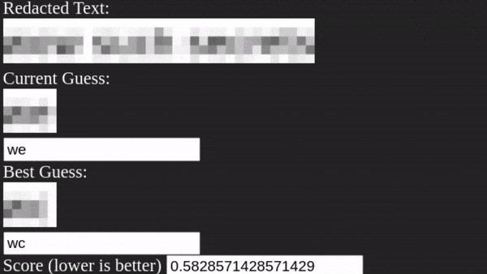



## Forensics Basics
<!-- _footer: By Collin Dewey-->

For CTF Competitions

---

## What is forensics?

Identify/Obtain Evidence

---

## Carving

binwalk

- Scans a file for files within the data
- `binwalk --dd='.*' <file>`

strings

- Shows you possibly strings within a binary file
- `strings -n 6 <file>`

photorec

- Data Recovery Tool

---

## Filesystem Forensics

RAW Image - A copy of the raw bytes that are stored on a hard drive.

- NTFS Master File Table (NT File System)
    - List of files & their metadata
    - MFT-Parsers
- Tools
    - FTKImager (Windows)
    - Autopsy (Windows)

---

## Windows Registry

Where Windows stores a lot of configuration

- RegRipper
    - Dump/Parse Registry

---

## RAM Forensics

Volatility

- Image Information
- Process List
- Process Dump
- Memory Dump
- Handle Info
- Registry Dump
- File Dump

---

## Steganography

- Hide special data within seemingly innocent data (Not metadata)
- Usually images or audio
    - Lossless formats

---

## Steganography Methods
- BlindHide
    - Changes the Least Significant Bit of Colors, and uses them for data
    - Starts at top left, works its way right, then down
    - Not secure
- HideSeek
    - Uses a password to generate a seed for where the first part of the data is
    - Continues to pick random spots based on that seed
    - BlindHide but "secure"
- FilterFirst
- BattleSteg

---

## Steganography Tools

Any advanced photo editor (Paint.NET, Krita, GIMP, Photoshop, Photopea)

[Digital Invisible Ink Toolkit](https://diit.sourceforge.net/)

[OpenStego](https://www.openstego.com/)

[Sherloq](https://github.com/GuidoBartoli/sherloq)

[StegOnline Checklist](https://georgeom.net/StegOnline/checklist)

---

## Unredacter

De-pixelate Text
- Specific font
- Specific blur block size
- Specific pixelation filter






Image License: <a href="https://www.gnu.org/licenses/gpl-3.0-standalone.html">GPL v3</a>


