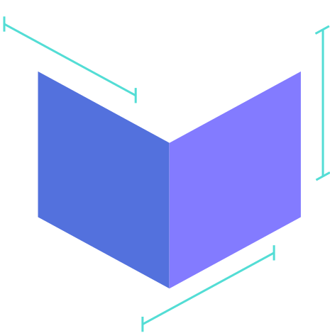
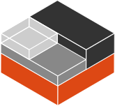

<link rel="stylesheet" href="../presentations.css">

# Introduction to Containers
<!-- _footer: By Collin Dewey-->

[Presentation Slides](/slides/intro-to-containers.html)

---

# Containers versus Virtual Machines

||Containers|Virtual Machines|
|---|---|---|
|Isolation|Good|Great|
|Kernel|Same as Host OS|Has own Kernel|
|Performance|Native Performance|Emulated/Virtualized Hardware|
|Resource Usage|Small, Dynamic|Large, Preallocated Resources|
|Ease of use|Easy to setup & change|Harder to setup, easy to change|
|Environment|Deterministic|Deviates (Updates, Configuration)|
|Quantity|Large Amount|Limited Amount|

Containers are usually used for one application or service.
Virtual Machines handle many applications or services.

---
<!-- _footer: securitylabs.datadoghq.com/articles/container-security-fundamentals-part-2-->

# How are containers setup on Linux?

Linux features for resource restrictions and isolations [^1]

- cgroups
- Namespaces (PID, NET, IPC, MNT, UTS, USER, TIME)
- Secure Computing Mode (seccomp)
- Apparmor and SELinux

[^1]: https://securitylabs.datadoghq.com/articles/container-security-fundamentals-part-2/

---
# How are containers setup on Windows?
<!-- _footer: msdn.microsoft.com/en-us/magazine/mt797649-->

Windows features for resource restrictions and isolations [^2]

- Job Objects
- Namespaces (Object, Process Table, Networking)

Linux containers can be run through the Windows Subsystem for Linux.
This means you will lose the raw performance advantages of containers.

[^2]: https://msdn.microsoft.com/en-us/magazine/mt797649

---

# Open Container Initiative (OCI)

Specification for how containers images are formatted and run.
Used by...

- Docker <!--(runc)-->
- Podman <!--(runc)-->
- systemd-nspawn
- Kubernetes

---

# Linux Containers (LXC)
<!--_footer: systemd-nspawn is also usable for this purpose-->

What if you want the permanence of a Virtual Machine but the performance of a Container?
- Not OCI compatible
- Used in Proxmox

---

# Creating an OCI Container Image

### What makes a container
Containers need to contain all Linux system files wanted by the software being used within the containers, such as libraries and dependencies.

### Generating an Image

OCI Images are created most often through using a `Dockerfile`. This file contains the stages to take a base OS, and transform it into your desired usecase.
Optionally, there may be a build stage that doesn't get pushed to the resulting image, for when software needs to be built.
These images are stored in layers, so containers can build on other containers, and share mutual data.

---

### Docker Container Registry / Github Container Registry
Containers can be stored locally, or uploaded to the internet for other people to download.

- hub.docker.com (Default)
- ghcr.io

---

# Container Security

### System Calls
Containers share the same kernel as the host, therefore syscalls are restricted through namespaces and seccomp. 
List namespaces with `lsns`.

### [gVisor](https://github.com/google/gvisor)

Google wasn't happy with that and made their own sandbox which sits between the container and the kernel, limiting syscalls.

---

### Image Security

When using other people's containers, you have to trust whoever made them to not embed malware.

Some containers were built a long time ago and some software may have vulnerabilities.

Blindly updating images can be a problem if the container registry uploader's account is compromised

---

### NIST's Application Container Security Guide [^3]
<!-- _footer: doi.org/10.6028/NIST.SP.800-190 -->

- API keys / Secrets should never be stored inside the image
- Use virtual networks with restricted access
- Properly secure container orchestration software

[^3]: https://doi.org/10.6028/NIST.SP.800-190

---

# Container Orchestration Software

Handles
- Multiple Machines
- Deployment
- Management
- Monitoring
- Resource Allocation

Kubernetes, Docker Swarm, Rancher, Portainer, Nomad, etc...

---

# Compose

See [Compose Presentation](https://collindewey.net/articles/intro-to-compose/)